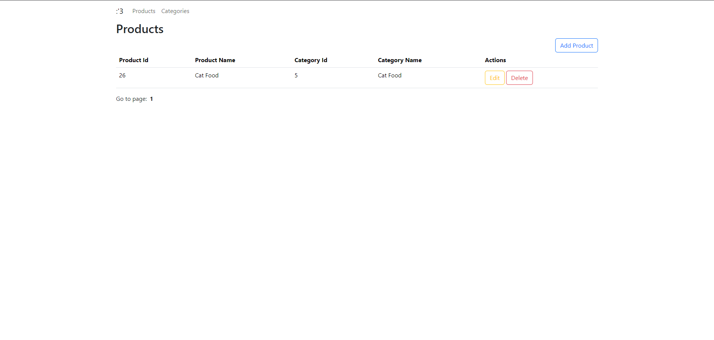
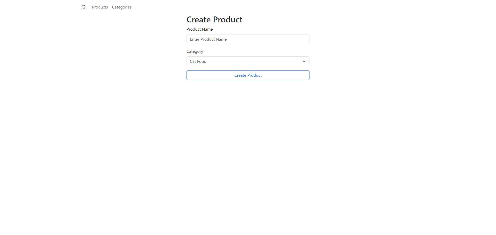
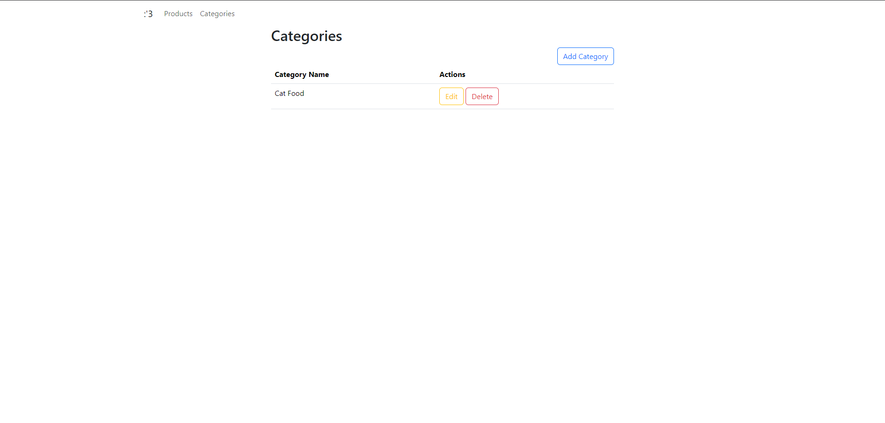
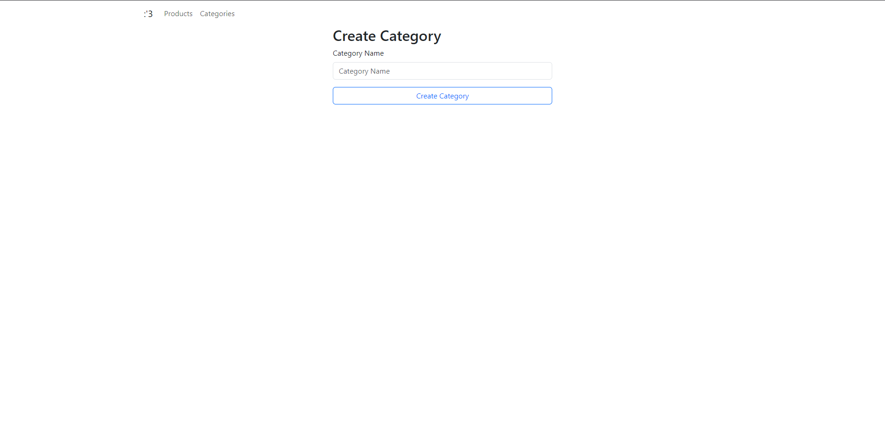

# Product Catalog CRUD (Node.js + EJS + MySQL)

This is a simple Product & Category Management System built using:

- Node.js + Express
- EJS Templating Engine
- MySQL (via mysql2)
- Server-side pagination
- `.env` file support for environment variables

---

## Features

- Category CRUD (Create, Read, Update, Delete)
- Product CRUD (with category mapping)
- Server-side pagination for product list
- Clean, minimal EJS views
- Environment variables for DB connection
- RESTful or simplified form handling

---

## Screenshots

### Product List Page


### Product Form (Create/Edit)


### Category List Page


### Category Form (Create/Edit)


---

## Getting Started

### Prerequisites

- Node.js (v16+)
- MySQL server
- npm

### Database Setup

Run the following SQL to create your database:

use product.sql file

## Extra: Add required packages and `.env` Support in Your Code

Make sure to install `dotenv`as well:

```bash
npm install dotenv mysql2 express method-override ejs
```

Create a `.env` file in the root of your project:

### `.env` variables

```env
DB_HOSTNAME=localhost
DB_USERNAME=root
DB_PASSWORD=
DB_NAME=product
PORT=7777
```

```bash
npm install
node server.js
```

Then visit 

```bash
http://localhost:7777
```